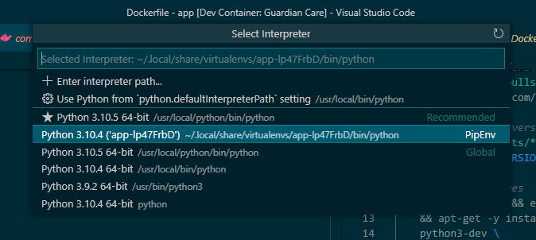

# Guardian Care
Guardian Care, a web-based product by fictitious company Guardian. Built for the UniSA Secure Software Development Course.

## Troubleshooting

## I get a 'MODULE_NOT_FOUND' error when running an npm command

There is a bug in VS Code when attaching a debugger to a node process. To resolve this error:

* Open the the settings cog > settings in the bottom left corner of VS Code
* Search for debug.node.autoAttach
* Set Auto Attach Filter to Disabled
* Close then reopen the terminal

## I get a "No Module named Flask" error when trying to run the API

The container is likely using the default global python environment, rather than the virtual environment where the dependencies (such as Flask) are installed.

1. In VS Code, press F1, then search for and select the menu option "Python: Select Interpreter".
2. Select the interpreter that's listed as the PipEnv interpreter



## I get the error "/mount/scripts/wait-for-it.sh: permission denied" when trying to Reopen in Container

There is a permissions issue in the wait-for-it.sh script, seemingly isolated to MacOS users, which prevents containers from starting.

1. Open the terminal, and navigate to the directory containing the cloned git repository.
2. Run the following command to allow execution for any user:
```bash
chmod a+x scripts/wait-for-it.sh
```